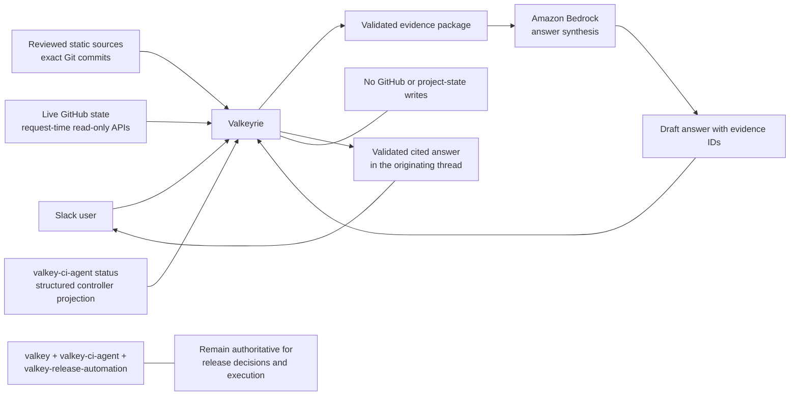

# RFC: Valkeyrie, a conversational assistant for Valkey

## Summary

Valkeyrie is a Slack assistant for the Valkey community. A user asks a question in an allowlisted Slack channel, and Valkeyrie returns a concise answer with links to the Valkey sources that support it.

The first public beta is deliberately narrow:

- It uses public Valkey project information.
- It cites immutable sources for documentation and code claims.
- It reads GitHub at request time for current project state.
- It can explain release state produced by existing automation.
- It cannot change GitHub, run workflows, merge pull requests, or publish releases.

GitHub remains the source of truth and review surface. AWS provides the conversational runtime and managed infrastructure. Existing Valkey automation keeps its current responsibilities.

This RFC defines the read-only beta implementation, its approval gates, and a separate Valkeyrie repository. It does not authorize public Slack deployment before the pilot gates pass.

## Product boundary at a glance

The diagram shows the central boundary: the model explains approved evidence, while GitHub and existing release systems remain authoritative.

## Problem

Valkey information is public but spread across documentation, source repositories, issues, pull requests, CI runs, release records, policies, and project websites. Answering a simple question often requires knowing:

- Which repository is authoritative.
- Which Valkey version or branch applies.
- Whether an older discussion still reflects current behavior.
- Whether current GitHub or release state must be checked live.

This creates repeated navigation work for users, contributors, and maintainers.

Representative questions include:

- Which release added hash-field expiration?
- Where should documentation for a new command be added?
- Which required checks are failing on this pull request?
- Was this fix backported to 8.1?
- What is blocking the current release candidate?
- Where is the canonical cluster-upgrade guidance?

## Goals

Valkeyrie will:

1. Provide one conversational entry point for common Valkey questions.
2. Cite canonical sources adjacent to factual claims.
3. Make the applicable repository, version, branch, commit, or live observation clear.
4. Separate immutable knowledge from current project state.
5. Ask for clarification or abstain when the evidence is insufficient.
6. Let maintainers review source selection, prompts, and evaluations through normal GitHub pull requests.
7. Reuse existing Valkey documentation and automation rather than duplicate it.
8. Operate with a small, understandable production architecture.

## Non-goals for the first public beta

The beta will not:

- Replace official documentation, GitHub, or existing release automation.
- Modify GitHub or any other Valkey project state.
- Run or rerun CI, dispatch workflows, merge changes, or publish releases.
- Decide whether a release is ready.
- Read general Slack history, direct messages, or private channels.
- Ingest private repositories, security advisories, or internal information.
- Browse the unrestricted web or execute arbitrary code.
- Index every file in every Valkey repository.
- Introduce a multi-agent hierarchy or a new workflow engine.

Future write operations would require a separate RFC and security review.

## Product principles

### Evidence before fluency

A project-specific factual claim is useful only when a user can verify it. Valkeyrie prefers a short supported answer over a broad answer it cannot substantiate.

### Version and freshness are part of correctness

Static documentation and source are resolved to immutable commits. Claims such as “current,” “open,” “passing,” “latest,” or “ready” require a request-time lookup and an observation time.

Valkeyrie must not silently combine released documentation, `unstable`, and historical branches. If the intended version cannot be resolved, it asks the user.

### The model explains; it does not establish authority

Deterministic code selects permitted sources, performs live reads, enforces limits, and validates citations. The model synthesizes the returned evidence into a useful response. Retrieved content and model output cannot change source policy, permissions, or release criteria.

### Start read-only

The runtime has no GitHub write permission and imports no credentials from existing CI or release automation. Its only beta writes are acknowledgements and answers in the originating Slack thread.

## Information sources

Valkeyrie treats three kinds of information differently.

### 1. Reviewed static knowledge

Selected documentation, policy, source, tests, and project guidance are built from exact Git commits. The Valkeyrie repository owns three reviewed inputs:

- `sources.yaml`: repository, included paths, excluded paths, revision policy, version scope, authority, and ingestion mode.
- `prompts/`: system, evidence-use, citation, clarification, and answer templates. Prompts are application inputs, not Knowledge Base documents.
- `evals/`: questions and assertions for source selection, retrieval, citations, version reasoning, abstention, injection, and safety.

The corpus workflow inventories every active, non-fork `valkey-io` repository. Each repository or path is classified as curated corpus, structured exact lookup, live GitHub state, or excluded with a reason. A newly discovered repository fails the inventory check until maintainers classify it.

#### Repository coverage

| Family | Repositories | Corpus material |
|---|---|---|
| Core, documentation, and project policy | `valkey`, `valkey-doc`, `valkey-io.github.io`, `community`, `.github`, `planet` | User and contributor documentation, commands, policies, selected source and tests, release notes, non-generated website content, and Planet contribution/content policy |
| Official modules and module development | `valkey-bloom`, `valkey-json`, `valkey-search`, `valkey-ldap`, `valkey-lua5.5`, `valkey-luajit`, `valkey-bundle`, `valkeymodule-rs` | Data, search, authentication, and scripting-engine behavior; commands, configuration and security guidance; examples, compatibility, packaging, release guidance, and selected source/tests |
| Official clients | `valkey-glide`, `valkey-glide-docs`, `valkey-glide-cpp`, `valkey-glide-csharp`, `valkey-glide-php`, `valkey-glide-ruby`, `valkey-go`, `valkey-py`, `valkey-java`, `valkey-swift`, `libvalkey`, `libvalkey-py`, `iovalkey`, `iovalkey-commands`, `spring-data-valkey`, `valkey-namespace` | README and public API documentation, examples, compatibility and release metadata, plus selected source/tests when documented behavior is insufficient |
| Deployment and user tools | `valkey-container`, `valkey-helm`, `valkey-operator`, `valkey-admin`, `valkey-try-me` | Installation, configuration, operational guidance, and user-facing behavior; experimental status is retained as authority metadata |
| Testing, benchmarking, provenance, and automation | `valkey-fuzzer`, `valkey-test-framework`, `valkey-perf-benchmark`, `verify-provenance`, `valkey-ci-agent`, `valkey-release-automation` | Maintainer-facing documentation, supported configuration, runbooks, and public interfaces needed to explain project behavior |
| Reviewed secondary synthesis | `valkey-skills` | Reviewed guidance within its declared scope; it never overrides canonical sources |
| Structured exact source | `valkey-hashes` | Release artifact digests and URLs through deterministic lookup, not semantic retrieval |

The remaining active repositories—`assets`, `one-time-for-planet`, and `iovalkey-interface-generator`—start as live-only or excluded because they contain bulk assets, unfinished aggregation work, or generated support code rather than authoritative Valkey guidance. Within curated repositories, generated command data, aggregated Planet output, vendored Lua sources, templates, and build artifacts remain excluded.

All active repositories remain available to typed live GitHub reads for issues, pull requests, checks, tags, releases, and repository state. Generated interfaces, vendored dependencies, build output, binaries, bulk assets, and mechanically mirrored content are not embedded. Large repositories are path-scoped rather than ingested wholesale.

#### Changing sources and immutable generations

The repositories above continue to change normally. On each approved refresh, the workflow resolves every included source to an exact commit and creates a new corpus generation. A published generation never changes; `active_generation` moves to the newly approved generation. Each request pins the active generation when it starts, so retries and citations use one coherent snapshot. Older generations remain available for in-flight requests and rollback.

“Immutable” therefore describes each indexed snapshot, not the upstream repositories and not the overall knowledge base. New commits produce a new generation instead of mutating an existing one.

### 2. Live project state

Typed, read-only GitHub integrations retrieve current public issues, pull requests, reviews, checks, workflow runs, tags, and releases while answering a request. A failed live lookup produces a partial answer or explicit inability to verify current state; it does not fall back to stale corpus data.

### 3. Existing automation state

Valkeyrie explains structured state produced by existing systems. It does not reproduce their decision logic.

For releases:

- The main `valkey` repository retains the visible **Start Release** entry point.
- `valkey-ci-agent` remains the deterministic controller for authorization, reconciliation, qualification, and protected tag/release publication.
- `valkey-release-automation` retains qualification builds, artifact and package publication, credentials, and downstream updates.
- Valkeyrie reads, cites, and explains their state; it never invokes `valkey-release-automation` directly.

`valkey-ci-agent` will publish a small machine-readable status projection for this purpose. Valkeyrie does not scrape a Markdown status display or import the controller's Python implementation.

### Prompt and request versioning

Prompt changes are reviewed in pull requests, run against the evaluation suite, and deploy with the application independently of corpus refreshes. Each request records `generation_id`, `prompt_revision`, `application_revision`, answer-model revision, inference configuration, cited static evidence IDs, and live-evidence URLs with observation times or hashes. This makes the answer auditable and its evidence context reconstructable; nondeterministic model output is not claimed to be exactly reproducible.

## Architecture

The initial architecture combines GitHub-native review and automation with managed AWS runtime services.

### GitHub owns

- Canonical source, project state, and human review.
- The source manifest, prompts, evaluation cases, and AWS CDK definitions.
- Separate workflows for application deployment and corpus promotion.
- Existing CI and release workflows.
- AWS access from Actions through narrowly scoped OIDC roles, not stored AWS keys.

### AWS owns

- Slack ingress and asynchronous request processing.
- Request deduplication and short-lived context.
- Immutable corpus artifacts and managed retrieval.
- Model inference.
- Secrets, logs, metrics, alarms, and runaway-usage safeguards.

The initial service set is:

- AWS CDK for reviewed infrastructure definitions.
- API Gateway HTTP API.
- Two Lambda functions: ingress and worker.
- SQS with a dead-letter queue.
- DynamoDB for deduplication, request state, context expiry, and the active corpus generation.
- Versioned S3 with a Bedrock-only `kb-documents/` root for normalized documents and metadata sidecars, plus a non-ingested `control/` root for manifests, digests, completion markers, and evaluation reports.
- Amazon Bedrock for model inference and Knowledge Base ingestion.
- OpenSearch Serverless as the derived hybrid text and vector index used by Bedrock Knowledge Bases.
- Secrets Manager and CloudWatch.

The detailed flow is in `valkeyrie-one-page-architecture.md`.

### Why both S3 and OpenSearch Serverless

GitHub at exact commits remains canonical. The Knowledge Base has one fixed S3 data source whose inclusion prefix is `kb-documents/`. Each generation has a subdirectory containing only normalized documents and Bedrock metadata sidecars. Manifests, digests, completion markers, evaluations, prompts, and deployment artifacts live under `control/` or in GitHub, outside the ingestible prefix.

OpenSearch Serverless stores the derived text chunks, embeddings, and searchable metadata produced from those documents. It is an index, not the canonical corpus. Keeping the S3 generation supports verification, rollback, and rebuilding the derived index; removing S3 would require a custom direct-ingestion pipeline.

### Separate deployment paths

Application and knowledge changes use separate GitHub Actions workflows and OIDC roles:

- **Application deployment:** prompt and application evaluation, pull request checks, and CDK synthesis, followed by deployment through a protected GitHub environment and a runtime health check.
- **Corpus promotion:** repository inventory, source resolution, corpus build, evaluation, S3 publication, Knowledge Base ingestion into OpenSearch Serverless, candidate smoke tests, and conditional activation.

A source refresh does not redeploy prompts or runtime code. An application or prompt deployment does not change `active_generation`.

### Model and retrieval

Phase 1 evaluates eligible Bedrock answer-model revisions and deploys the highest-quality revision that passes the factual-correctness, evidence-use, version-reasoning, safety, structured-output, latency, and availability thresholds. Cost is recorded but is not a model-selection constraint. Phase 1 also selects the embedding model and chunking configuration; both remain fixed through the beta so every retained generation shares one vector space and one Knowledge Base/index. Changing either requires a deliberate full-index migration, not a routine corpus refresh.

Valkeyrie uses Bedrock Knowledge Bases for parsing, chunking, embeddings, vector storage, synchronization, and retrieval mechanics. The application remains responsible for source authority, version correctness, and verifying that evidence supports each generated claim.

The Knowledge Base uses OpenSearch Serverless hybrid retrieval because Valkey questions combine semantic concepts with exact commands, symbols, paths, errors, pull request numbers, commits, and versions. Exact identifiers use deterministic lookup or typed GitHub reads rather than relying on vector retrieval.

Valkeyrie calls the Knowledge Base retrieval API, applies a mandatory generation filter, and constructs the final evidence package itself. Deterministic code validates source metadata and renders citations; the model cannot establish authority or invent links.

## Slack behavior

The first interface is an allowlisted public Slack channel.

1. API Gateway forwards a request to the ingress Lambda.
2. The Lambda verifies the Slack signature, timestamp, workspace, application, and channel.
3. It sends the verified event to SQS and returns the transport acknowledgement only after SQS accepts it, within Slack's three-second deadline.
4. The worker uses the AWS Lambda idempotency pattern backed by DynamoDB, keyed by Slack event ID. On the first processing attempt it records the corpus, prompt, application, answer-model, and inference revisions; retries reuse them. It also records cited static evidence IDs and live-evidence observation references. An expired in-progress record can be recovered after a worker timeout.
5. The worker posts a short acknowledgement and later the answer in the originating thread.

SQS and Lambda provide at-least-once processing. Completed requests suppress repeated model work and ordinary redeliveries. Before each Slack acknowledgement or answer post, the worker durably records a fenced send intent in DynamoDB. Only failures known to precede that intent, or definitive Slack rejections, enter normal retry handling. A timeout or crash after send intent leaves that individual post terminal-but-unconfirmed and subject to reconciliation or manual recovery; no worker automatically reposts it. This can sacrifice a message rather than duplicate one, so Valkeyrie does not promise exactly-once Slack-visible delivery.

Valkeyrie requests no broad channel-history scope. It retains only request and thread state needed for approved follow-ups, for the shortest useful period. DynamoDB TTL performs eventual cleanup; the application must treat expired context as unavailable immediately rather than waiting for physical deletion.

## Corpus updates

A scheduled GitHub Actions workflow provides one reviewable path from changing repositories to a new active generation:

1. Inventory active repositories and require every repository and included path to have an explicit manifest classification.
2. Resolve approved sources to exact commits and normalize selected content into supported document and structured-record formats.
3. Build a generation whose content-derived ID covers the complete retrievable artifacts, source manifest, authority/version metadata, and fixed retrieval/indexing configuration. Tag every indexed document with that generation ID.
4. Run repository-family coverage, retrieval, citation, version, injection, and answer-quality checks.
5. Use GitHub OIDC to assume a narrowly scoped AWS publishing role.
6. Publish normalized documents and metadata sidecars under `kb-documents/generations/<generation_id>/`. A retry creates missing objects, accepts an existing object only when its checksum matches the canonical manifest, and rejects a mismatch. The promotion role cannot overwrite or delete generation objects.
7. Publish the verified manifest and a completion marker under `control/generations/<generation_id>/`, with the completion marker written last.
8. After verifying the complete manifest and marker, start ingestion for the Knowledge Base's fixed S3 data source.
9. Smoke-test the candidate by retrieving with its explicit generation filter.
10. Compare-and-set one DynamoDB `active_generation` record only after the candidate passes.

Every static retrieval includes the generation recorded on the request; the retrieval wrapper fails closed if the filter is absent or that generation is unavailable. Candidate and old-generation vectors may coexist in the managed index, but they are not eligible for other requests. The beta retains generations rather than garbage-collecting them. Rollback selects a retained passing generation by updating the pointer.

Source, authority, prompt, or application changes require normal human review. Routine source refreshes run the checks automatically, but activation requires approval through the protected corpus-promotion environment.

## Security and privacy

The beta security boundary is intentionally small:

- No project-state write credential exists.
- The deployed GitHub identity is read-only and separate from existing automation identities.
- GitHub Actions uses short-lived OIDC credentials restricted to an approved repository and branch or environment.
- Slack secrets and any GitHub App private key are stored in Secrets Manager.
- Retrieved text is untrusted data and cannot select tools, permissions, or sources.
- Secrets and credential-shaped values are excluded from prompts and logs.
- Replies are restricted to the originating allowlisted thread.
- Logs use an approved retention period and avoid retaining raw Slack content unless needed for a diagnosed failure.
- A kill switch can disable ingress or model processing.
- Per-request limits, concurrency controls, and emergency circuit breakers supplement AWS Budgets and cost anomaly alerts. They protect against loops, abuse, and configuration errors; they are not model-quality or architecture-selection constraints.

Any private source, additional Slack scope, longer retention, proactive message, or project-state write is a new security boundary and requires separate approval.

## Evaluation and operations

The prototype maintains a public, reviewable evaluation set covering:

- Documentation and version-specific behavior.
- Repository and contributor navigation.
- Exact identifiers and canonical links.
- Live GitHub state and dependency failures.
- Release-state explanation without independent readiness decisions.
- Ambiguity, conflicting sources, and required abstention.
- Prompt injection, fabricated objects, privacy, and write requests.

Before a pilot, maintainers agree on the quality and reliability thresholds. Launch requires:

- No fabricated citation in the launch evaluation.
- Correct clarification or abstention for unsafe and unsupported cases.
- No security, privacy, or unauthorized-write failure.
- Demonstrated corpus rollback and runtime kill switch.
- Measured latency and dependency reliability appropriate for the pilot.
- Cost and usage telemetry with tested runaway-usage circuit breakers.
- At least two service owners, an incident path, retention policy, and infrastructure owner.

CloudWatch alerts on ingress or worker failures, SQS age and dead letters, invalid citations, corpus age, dependency throttling, and anomalous usage. Operational details belong in a runbook, not this RFC.

## Rollout

1. **Local prototype:** cited answers from a small, high-value corpus; no Slack traffic.
2. **Limited Slack knowledge pilot:** selected documentation and navigation questions in named channels.
3. **Read-only public beta:** typed live GitHub state and structured release-state explanations.

Progression depends on measured quality, safety, reliability, and owner capacity—not feature count or model price.

## Decisions requested

1. Approve Valkeyrie as a cited, version-aware, read-only conversational assistant for Valkey.
2. Approve the manifest-driven repository coverage, versioned prompts, immutable corpus generations, and separate live project state.
3. Approve a bounded prototype using GitHub Actions and the managed AWS architecture in this RFC.
4. Approve OpenSearch Serverless hybrid retrieval and selection of the Bedrock model by measured quality and operational reliability rather than price.
5. Approve a separate `valkey-io/valkeyrie` repository, subject to normal project process.
6. Confirm that a Slack pilot and public beta each require separate owner, security, privacy, operations, and runaway-usage safeguard approval.

## References

- [Valkey](https://github.com/valkey-io/valkey)
- [Valkey documentation](https://github.com/valkey-io/valkey-doc)
- [Valkey skills](https://github.com/valkey-io/valkey-skills)
- [Valkey CI agent](https://github.com/valkey-io/valkey-ci-agent)
- [Valkey release automation](https://github.com/valkey-io/valkey-release-automation)
- [GitHub Actions OIDC for AWS](https://docs.github.com/en/actions/how-tos/secure-your-work/security-harden-deployments/oidc-in-aws)
- [Amazon Bedrock Knowledge Bases](https://docs.aws.amazon.com/bedrock/latest/userguide/knowledge-base.html)
- [Configure Knowledge Base retrieval and hybrid search](https://docs.aws.amazon.com/bedrock/latest/userguide/kb-test-config.html)
- [Vector search collections in OpenSearch Serverless](https://docs.aws.amazon.com/opensearch-service/latest/developerguide/serverless-vector-search.html)
- [Using Lambda with SQS](https://docs.aws.amazon.com/lambda/latest/dg/with-sqs.html)
- [DynamoDB TTL](https://docs.aws.amazon.com/amazondynamodb/latest/developerguide/TTL.html)
